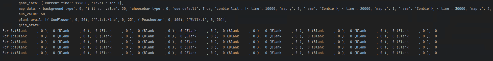

# PythonPlantsVsZombies with AI

Game part fork from [PythonPlantsVsZombies](https://github.com/marblexu/PythonPlantsVsZombies)

Reference: https://hanadyg.github.io/portfolio/report/INF581_report.pdf

Proposal report: https://docs.qq.com/slide/DZk9qTk9vWWJKS29Y

## Intro
- 四种植物: 豌豆射手、向日葵、樱桃炸弹、坚果墙, 无尽模式, 僵尸随机出现, 且僵尸只有血量和行动速度区别, 僵尸出现数量和频率随时间增大
- state ( 每个格子上的植物、每个格子上的僵尸血量总和、可用植物状态、阳光数 )
- 测试指标: 存活时间 ( state 中有个 current_time )

- 运行游戏 `python main.py --level 1 --agent_type random --game_speed 1.0`  
  - level 为选择关卡，理论上需要改成随机出现的(todo)
  - 游戏运行时按下任意键可以打印当前状态

## TODO
- [x] 分成 GameState, Agent, GameRunner 三部分
- [ ] 把僵尸改成随机出现, 并完善测试指标
- [ ] 处理bug
- [ ] logic-based method
- [ ] Q-learning
- [ ] [Deep Q-network](https://hanadyg.github.io/portfolio/report/INF581_report.pdf)
- [ ] [option] 更多植物和更多种类僵尸
- [ ] [option] 如何更优地选择植物

## 游戏部分
```
├── state
│   ├── levle.py     # 游戏界面
│   ├── mainmenu.py  # 开始界面
│   ├── screen.py    # 结束界面
│    ...
├── tool.py          # controler
```

## AI Agent
```
├── agents
│   ├── env.py       # 环境状态, 游戏更新相关, 包括 GameState 和 GameRunner (重载levle, Control)
│   ├── agent.py     # 智能体实现 ( manual, random, logic, DQN )
│   ├── 
│    ...

```

## 已知 Bug

- 土豆地雷不会爆炸 ( 原版就有, 可能是碰撞检测出的问题 )
  - 也可以改成用樱桃炸弹，那就不用修了
- 调整 game_speed 时会导致行为和原先不同
  - 训练强化学习方法时按默认速度跑太慢了, 所以需要游戏时间变快些, 理论上应该等价于快放，比方说前后僵尸距离应该不变
  - 现在的方法是在 `pg.time.get_ticks()` 时乘个倍数, 同时等比例调大 fps (瞎写的), 但是目前前后僵尸间距离会缩小


